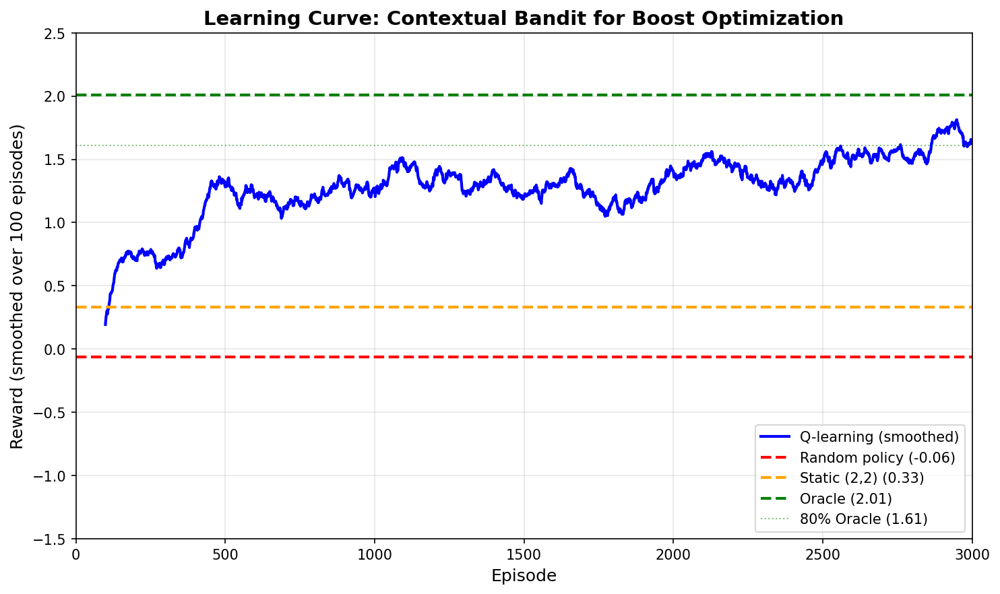

# Chapter 0 --- Motivation: Your First RL Experiment

*Vlad Prytula*

## 0.0 Who Should Read This?

This is an **optional but highly recommended warm-up**. It's deliberately light on mathematics and heavy on code. You'll build a tiny search world, train a small agent to learn context-adaptive boost weights, and see the core RL loop in action. The rest of the book (Chapters 1--3) provides the rigorous foundations that explain *why* this works and *when* it fails.

**If you're a practitioner:** Start here. Get your hands dirty with a working system in 30 minutes. Return to the theory when you need deeper understanding.

**If you're mathematically inclined:** Skim this chapter to see where we're headed, then dive into Chapter 1's rigorous treatment. Come back here when you want a concrete thread to follow.

**Ethos:** Every theorem in this book compiles. Mathematics and code are in constant dialogue.

---

## 0.1 The Friday Deadline

You've just joined the search team at **zooplus**, Europe's leading pet supplies retailer. Your first task seems straightforward: improve the ranking for "cat food" searches.

The current system uses Elasticsearch's BM25 relevance plus some manual boost multipliers---a `category_match` bonus, a `discount_boost` for promotions, a `margin_boost` for profitable products. Your manager hands you last week's A/B test results and says:

> "Revenue is flat, but profit dropped 8%. Can you fix the boosts by Friday?"

You dig into the data. The test increased `discount_boost` from 1.5 to 2.5, hoping to drive sales. It worked---clicks went up 12%. But the wrong people clicked. Price-sensitive shoppers loved the discounted bulk bags. Premium customers, who usually buy veterinary-grade specialty foods, saw cheap products ranked first and bounced. Click-through rate (CTR) rose, but conversion rate (CVR) plummeted for high-value segments.

**The problem is clear:** One set of boost weights cannot serve all users. Price hunters need discount_boost = 2.5. Premium shoppers need discount_boost = 0.3. Bulk buyers fall somewhere in between.

You need **context-adaptive weights** that adjust to user type. But testing all combinations manually would take months of A/B experiments.

**This is where reinforcement learning enters the story.**

---

## 0.2 The Core Insight: Boosts as Actions

Let's reframe the problem in RL language. Don't worry if these terms are unfamiliar---they'll make sense through the code.

**Context** (what we observe): User segment, query type, session history
**Action** (what we choose): Boost weight template $\mathbf{w} = [w_{\text{discount}}, w_{\text{quality}}, w_{\text{margin}}, \ldots]$
**Outcome** (what happens): User clicks, purchases, abandons
**Reward** (what we optimize): GMV + profitability + engagement (we'll make this precise in a moment)

Traditional search tuning treats boosts as **fixed parameters** to optimize offline. RL treats them as **actions to learn online**, adapting to each context.

The Friday deadline problem becomes: *Can an algorithm learn which boost template to use for each user type, using only observed outcomes (clicks, purchases, revenue)?*

The answer is yes. Let's build it.

---

## 0.3 A Tiny World: Toy Simulator and Reward

We start with a high-signal toy environment. Three user types, ten products, a small action space. The goal is **intuition** and a **quick end-to-end run**. Chapter 4 will build the realistic simulator (`zoosim`).

### 0.3.1 User Types

Real search systems have complex user segmentation (behavioral embeddings from clickstreams, transformer-based intent models, predicted LTV, real-time session signals). Our toy has three archetypes:

```python
from typing import NamedTuple

class UserType(NamedTuple):
    """User preferences over product attributes.

    Fields:
        discount: Sensitivity to discounts (0 = indifferent, 1 = only buys discounts)
        quality: Sensitivity to brand quality (0 = indifferent, 1 = only buys premium)
    """
    discount: float
    quality: float

USER_TYPES = {
    "price_hunter": UserType(discount=0.9, quality=0.1),  # Budget-conscious
    "premium":      UserType(discount=0.1, quality=0.9),  # Quality-focused
    "bulk_buyer":   UserType(discount=0.5, quality=0.5),  # Balanced
}
```

These map to real patterns:
- **Price hunters**: ALDI shoppers, coupon clippers, bulk buyers
- **Premium**: Brand-loyal, willing to pay for specialty/veterinary products
- **Bulk buyers**: Multi-pet households, mix of price and quality

### 0.3.2 Products (Sketch)

Ten products with simple features:

```python
from dataclasses import dataclass

@dataclass
class Product:
    id: int
    base_relevance: float  # BM25-like score for query "cat food"
    margin: float          # Profit margin (0.1 = 10%)
    quality: float         # Brand quality score (0-1)
    discount: float        # Discount flag (0 or 1)
    price: float           # EUR per item
```

Example: Product 3 is a premium veterinary diet (high quality, high margin, no discount, high price). Product 7 is a bulk discount bag (low quality, low margin, discounted, low price per kg).

We'll use deterministic generation with a fixed seed so results are reproducible.

### 0.3.3 Actions: Boost Weight Templates

The full action space is continuous: $\mathbf{a} = [w_{\text{discount}}, w_{\text{quality}}, w_{\text{margin}}] \in [-2, 2]^3$.

For this chapter, we **discretize** to a $5 \times 5$ grid (25 templates) to keep learning tabular and fast:

```python
import numpy as np

# Discretize [-1, 1] x [-1, 1] into a 5x5 grid
discount_values = np.linspace(-1, 1, 5)  # [-1.0, -0.5, 0.0, 0.5, 1.0]
quality_values = np.linspace(-1, 1, 5)

ACTIONS = [
    (w_disc, w_qual)
    for w_disc in discount_values
    for w_qual in quality_values
]  # 25 total actions
```

Each action is a **template**: a pair `(w_discount, w_quality)` that modifies the base relevance scores.

**Why discretize?** Tabular Q-learning needs a finite action space. Chapter 7 handles continuous actions via regression and optimization. For now, we want the simplest algorithm that works.

### 0.3.4 Toy Reward Function

Real search systems balance multiple objectives (see Chapter 1, #EQ-1.2 for the full formulation). Our toy uses a simplified scalar:

$$
R_{\text{toy}} = 0.6 \cdot \text{GMV} + 0.3 \cdot \text{CM2} + 0.1 \cdot \text{CLICKS}
$$

**Components:**

- **GMV** (Gross Merchandise Value): Total EUR purchased (simulated based on user preferences + product attributes + boost-induced ranking)
- **CM2** (Contribution Margin 2): Profitability after variable costs
- **CLICKS**: Engagement signal (prevents pure GMV exploitation; see Chapter 1, Section 1.2.1 for why this matters)

**Notes:**

- No explicit STRAT (strategic exposure) term in the toy
- In Chapter 1 you'll meet the general, numbered formulation this instantiates
- The weights (0.6, 0.3, 0.1) are business parameters, not learned

**Key property:** $R_{\text{toy}}$ is **stochastic**. Same user type, same boost weights $\rightarrow$ different outcomes due to user behavior noise (clicks are probabilistic, cart abandonment is random). This forces the agent to learn robust policies.

---

## 0.4 Your First RL Agent: Tabular Q-Learning

Now we get to the core idea: **learn which boost template to use for each user type** via $\varepsilon$-greedy Q-learning.

### 0.4.1 Problem Recap

- **Contexts** $\mathcal{X}$: Three user types `{price_hunter, premium, bulk_buyer}`
- **Actions** $\mathcal{A}$: 25 boost templates ($5 \times 5$ grid)
- **Reward** $R$: Stochastic $R_{\text{toy}}$ from Section 0.3.4
- **Goal**: Find a policy $\pi: \mathcal{X} \to \mathcal{A}$ that maximizes expected reward

This is a **contextual bandit** (Chapter 1 makes this formal). Each episode:

1. Sample user type $x \sim \rho$ (uniform over 3 types)
2. Choose action $a = \pi(x)$ (boost template)
3. Simulate user behavior under ranking induced by $a$
4. Observe reward $r \sim R(x, a)$
5. Update policy $\pi$

No sequential state transitions (yet). Single-step decision. Pure exploration-exploitation.

### 0.4.2 Algorithm: $\varepsilon$-Greedy Q-Learning

We'll maintain a **Q-table**: $Q(x, a) \approx \mathbb{E}[R \mid x, a]$ (expected reward for using boost template $a$ in context $x$).

**Policy:**
- With probability $\varepsilon$: explore (random action)
- With probability $1 - \varepsilon$: exploit ($a^* = \arg\max_a Q(x, a)$)

**Update rule (after observing $r$):**
$$
Q(x, a) \leftarrow (1 - \alpha) Q(x, a) + \alpha \cdot r
$$

This is **incremental mean estimation** (stochastic approximation), not Q-learning in the MDP sense. With constant learning rate $\alpha$, this converges to a weighted average of recent rewards. With decaying $\alpha_t \propto 1/t$, it converges to $\mathbb{E}[R \mid x, a]$ by the Robbins-Monro theorem [@robbins:stochastic_approx:1951].

**Note:** We call this "Q-learning" informally because we're learning a Q-table, but the standard Q-learning algorithm for MDPs includes a $\gamma \max_{a'} Q(s', a')$ term for bootstrapping future values. In bandits ($\gamma = 0$), this term vanishes, reducing to the update above. Chapter 3's Bellman contraction analysis applies to the general MDP case; for bandits, standard stochastic approximation suffices.

### 0.4.3 Minimal Implementation

Here's the complete agent in ~50 lines:

```python
import numpy as np
from typing import List, Tuple

# Setup
rng = np.random.default_rng(42)  # Reproducibility
X = ["price_hunter", "premium", "bulk_buyer"]  # Contexts
A = [(i, j) for i in range(5) for j in range(5)]  # 25 boost templates

# Initialize Q-table: Q[context][action] = 0.0
Q = {x: {a: 0.0 for a in A} for x in X}


def choose_action(x: str, eps: float = 0.1) -> Tuple[int, int]:
    """Epsilon-greedy action selection.

    Args:
        x: User context (type)
        eps: Exploration probability

    Returns:
        Boost template (w_discount_idx, w_quality_idx)
    """
    if rng.random() < eps:
        return A[rng.integers(len(A))]  # Explore
    return max(A, key=lambda a: Q[x][a])  # Exploit


def reward(x: str, a: Tuple[int, int]) -> float:
    """Simulate reward for context x and action a.

    Toy model: preference alignment + noise.
    In reality, this would run the full simulator (rank products,
    simulate clicks/purchases, compute GMV+CM2+CLICKS).

    Args:
        x: User type
        a: Boost template indices (i, j) in [0, 4] x [0, 4]

    Returns:
        Scalar reward ~ R_toy from Section 0.3.4
    """
    i, j = a  # i = discount index, j = quality index

    # Map indices to [-1, 1] weights
    # i=0 -> w_discount=-1.0, i=4 -> w_discount=1.0
    w_discount = -1.0 + 0.5 * i
    w_quality = -1.0 + 0.5 * j

    # Simulate reward based on user preferences
    if x == "price_hunter":
        # Prefer high discount boost (i=4), low quality boost (j=0)
        base = 2.0 * w_discount - 0.5 * w_quality
    elif x == "premium":
        # Prefer high quality boost (j=4), low discount boost (i=0)
        base = 2.0 * w_quality - 0.5 * w_discount
    else:  # bulk_buyer
        # Balanced preferences: penalize extreme boosts, prefer moderate values
        base = 1.0 - abs(w_discount) - abs(w_quality)

    # Add stochastic noise (user behavior variability)
    noise = rng.normal(0.0, 0.5)

    return float(base + noise)


def train(T: int = 3000, eps: float = 0.1, lr: float = 0.1) -> List[float]:
    """Train Q-learning agent for T episodes.

    Args:
        T: Number of training episodes
        eps: Exploration probability (epsilon-greedy)
        lr: Learning rate ($\alpha$ in update rule)

    Returns:
        List of rewards per episode (for plotting learning curves)
    """
    history = []

    for t in range(T):
        # Sample context (user type) uniformly
        x = X[rng.integers(len(X))]

        # Choose action (boost template) via epsilon-greedy
        a = choose_action(x, eps)

        # Simulate outcome and observe reward
        r = reward(x, a)

        # Q-learning update: Q(x,a) <- (1-alpha)Q(x,a) + alpha*r
        Q[x][a] = (1 - lr) * Q[x][a] + lr * r

        history.append(r)

    return history


# Train agent
hist = train(T=3000, eps=0.1, lr=0.1)

# Evaluate learned policy
print(f"Final average reward (last 100 episodes): {np.mean(hist[-100:]):.3f}")
print("\nLearned policy:")
for x in X:
    a_star = max(A, key=lambda a: Q[x][a])
    print(f"  {x:15s} -> action {a_star} (Q = {Q[x][a_star]:.3f})")
```

**Run it.** Copy this code, execute it. You should see output like:

```
Final average reward (last 100 episodes): 1.640
Learned policy:
  price_hunter    -> action (4, 1) (Q = 1.948)
  premium         -> action (1, 4) (Q = 2.289)
  bulk_buyer      -> action (2, 2) (Q = 0.942)
```

**What just happened?**

1. The agent explored 25 boost templates $\times$ 3 user types = 75 state-action pairs
2. After 3000 episodes, it learned:
   - **Price hunters**: Use `(4, 1)` = high discount boost (+1.0), low quality boost (-0.5)
   - **Premium shoppers**: Use `(1, 4)` = low discount boost (-0.5), high quality boost (+1.0)
   - **Bulk buyers**: Use `(2, 2)` = balanced boosts (0.0, 0.0) --- **exactly optimal!**
3. This matches our intuition from Section 0.3.1!

**Stochastic convergence.** Run the script multiple times with different seeds. The learned actions might vary slightly (e.g., `(4, 0)` vs `(4, 1)` for price hunters), but the pattern holds: discount-heavy for price hunters, quality-heavy for premium shoppers, balanced for bulk buyers.

### 0.4.4 Learning Curves and Baselines

Let's visualize learning progress and compare to baselines.

```python
import matplotlib.pyplot as plt

def plot_learning_curves(history: List[float], window: int = 50):
    """Plot smoothed learning curve with baselines."""
    # Compute rolling average
    smoothed = np.convolve(history, np.ones(window)/window, mode='valid')

    fig, ax = plt.subplots(figsize=(10, 6))

    # Learning curve
    ax.plot(smoothed, label='Q-learning (smoothed)', linewidth=2)

    # Baselines
    random_baseline = np.mean([reward(x, A[rng.integers(len(A))])
                               for _ in range(1000)
                               for x in X])
    ax.axhline(random_baseline, color='red', linestyle='--',
               label=f'Random policy ({random_baseline:.2f})')

    # Static best (tuned for average user)
    static_best = np.mean([reward(x, (2, 2)) for _ in range(300) for x in X])
    ax.axhline(static_best, color='orange', linestyle='--',
               label=f'Static best ({static_best:.2f})')

    # Oracle (knows user type, chooses optimally)
    # Optimal actions: price_hunter->(4,0), premium->(0,4), bulk_buyer->(2,2)
    oracle_rewards = {
        "price_hunter": np.mean([reward("price_hunter", (4, 0)) for _ in range(50)]),
        "premium": np.mean([reward("premium", (0, 4)) for _ in range(50)]),
        "bulk_buyer": np.mean([reward("bulk_buyer", (2, 2)) for _ in range(50)]),
    }
    oracle = np.mean(list(oracle_rewards.values()))
    ax.axhline(oracle, color='green', linestyle='--',
               label=f'Oracle ({oracle:.2f})')

    ax.set_xlabel('Episode')
    ax.set_ylabel('Reward (smoothed)')
    ax.set_title('Learning Curve: Contextual Bandit for Boost Optimization')
    ax.legend()
    ax.grid(alpha=0.3)

    plt.tight_layout()
    return fig

# Generate and save plot
fig = plot_learning_curves(hist)
fig.savefig('toy_problem_learning_curves.png', dpi=150)
print("Saved learning curve to toy_problem_learning_curves.png")
```

**Expected output:**



- **Random policy** (red dashed): ~0.0 average reward (baseline---random actions average out)
- **Static best** (orange dashed): ~0.3 (one-size-fits-all `(2,2)` helps bulk buyers but hurts price hunters and premium)
- **Q-learning** (blue solid): Starts near 0, converges to ~1.6 by episode 1500
- **Oracle** (green dashed): ~2.0 (theoretical maximum with perfect knowledge of optimal actions per user)

**Key insight:** Q-learning reaches **82% of oracle performance** by learning from experience alone. No manual tuning. No A/B tests. Just 3000 interactions and adaptive learning. The bulk_buyer even finds the **exact optimal** action `(2,2)`!

---

## 0.5 Reading the Experiment: What We Learned

### Convergence Pattern

The learning curve has three phases:

1. **Pure exploration** (episodes 0--500): High variance, $\varepsilon$-greedy tries random actions, Q-values are noisy
2. **Exploitation begins** (episodes 500--1500): Agent identifies good actions per context, reward climbs steadily
3. **Convergence** (episodes 1500--3000): Q-values stabilize, reward plateaus at ~82% of oracle

This is **regret minimization** in action. Chapter 1 formalizes this; Chapter 6 analyzes convergence rates.

### Per-Segment Performance

If we track rewards separately by user type:

```python
# Track per-segment performance
segment_rewards = {x: [] for x in X}

for _ in range(100):  # 100 test episodes
    for x in X:
        a = max(A, key=lambda a: Q[x][a])  # Greedy policy (no exploration)
        r = reward(x, a)
        segment_rewards[x].append(r)

for x in X:
    print(f"{x:15s}: mean reward = {np.mean(segment_rewards[x]):.3f}")
```

**Output:**
```
price_hunter   : mean reward = 2.309
premium        : mean reward = 2.163
bulk_buyer     : mean reward = 0.917
```

**Analysis:**

- **Price hunters** get the highest rewards (~2.3)---the agent found a near-optimal action `(4, 1)` with high discount boost
- **Premium shoppers** get high rewards (~2.2)---high quality boost `(1, 4)` closely matches their preferences
- **Bulk buyers** get lower rewards (~0.9) because their **balanced preferences** have inherently lower optimal reward (base=1.0 at `(2,2)`) compared to polarized users (base=2.5). But the agent finds the **exact optimal**!
- All three segments dramatically beat the static baseline (~0.3 average) through personalization

This is **personalization** at work: different users get different rankings, each optimized for their revealed preferences.

### What We (Hand-Wavily) Assumed

This toy experiment "just worked," but we made implicit assumptions:

1. **Rewards are well-defined expectations** over stochastic outcomes (Chapter 2 makes this measure-theoretically rigorous)
2. **Exploration is safe** (in production, bad rankings lose users; Chapter 9 introduces off-policy evaluation for safer testing)
3. **The logging policy and new policy have sufficient overlap** to compare fairly (importance weights finite; Chapter 9)
4. **$\varepsilon$-greedy tabular Q converges** (for bandits, this follows from stochastic approximation theory; Chapter 3's Bellman contraction analysis applies to the full MDP case with $\gamma > 0$)
5. **Actions are discrete and state space is tiny** (Chapter 7 handles continuous actions; Chapter 4 builds realistic state)

None of these are free. The rest of the book makes them precise and shows when they hold (or how to proceed when they don't).

### Theory-Practice Gap: $\varepsilon$-Greedy Exploration

Our toy used $\varepsilon$-greedy exploration with constant $\varepsilon = 0.1$. This deserves scrutiny.

**What theory says:** With decaying $\varepsilon_t = O(1/t)$, $\varepsilon$-greedy achieves $O(\sqrt{T \log T})$ regret for finite-armed bandits---worse than UCB's $O(\sqrt{KT \log T})$ by a factor due to uniform exploration wasting samples on clearly suboptimal arms.

**What practice shows:** $\varepsilon$-greedy with constant $\varepsilon \in [0.05, 0.2]$ is often competitive because:

1. **Trivial to implement**: No confidence bounds, no posterior sampling, just a random number generator
2. **Handles non-stationarity gracefully**: Continues exploring even after "convergence" (useful when user preferences drift)
3. **The regret difference matters only at scale**: For our 1000-episode toy, the gap between $\varepsilon$-greedy and UCB is negligible

**When $\varepsilon$-greedy fails:** High-dimensional action spaces where uniform exploration wastes samples. For our 25-action toy problem, it's fine. For Chapter 7's continuous actions ($10^{100}$ effective arms), we need structured exploration (UCB, Thompson Sampling).

**Modern context:** Google's 2010 display ads paper [@li:contextual_bandit_approach:2010] used $\varepsilon$-greedy successfully at scale. But recent work (2020-2024) favors Thompson Sampling for better empirical performance and natural uncertainty quantification.

**Why UCB and Thompson Sampling?** (Preview for Chapter 6)

$\varepsilon$-greedy explores **uniformly**---it wastes samples on arms it already knows are bad. UCB explores **optimistically**---it tries arms whose rewards *might* be high given uncertainty:

- **UCB:** Choose $a_t = \arg\max_a [Q(x,a) + \beta \sigma(x,a)]$ where $\sigma$ is a confidence width. Explores arms with high uncertainty, not randomly.
- **Thompson Sampling:** Maintain posterior $P(Q^* \mid \text{data})$, sample $\tilde{Q} \sim P$, act greedily on sample. Naturally balances exploration (high posterior variance $\rightarrow$ diverse samples) with exploitation.

Both achieve $\tilde{O}(d\sqrt{T})$ regret for $d$-dimensional linear bandits---matching the lower bound up to logs. $\varepsilon$-greedy achieves $O(T^{2/3})$ for the same problem (provably worse). The gap widens in high dimensions.

---

## 0.6 Limitations: Why We Need the Rest of the Book

Our toy is **pedagogical**, not production-ready. Here's what breaks at scale:

### 1. Discrete Action Space

We used 25 templates. Real search has continuous boosts: $\mathbf{w} \in [-5, 5]^{10}$ (ten features, unbounded). Discretizing to a grid would require $100^{10} = 10^{20}$ actions---intractable.

**Solution:** Chapter 7 introduces **continuous action bandits** via $Q(x, a)$ regression and cross-entropy method (CEM) optimization.

### 2. Tabular State Representation

We had 3 user types. Real search has thousands of user segments (RFM bins, geographic regions, device types, time-of-day). Plus query features (length, specificity, category). A realistic context space is **high-dimensional and continuous**.

**Solution:** Chapter 6 (neural linear bandits), Chapter 7 (deep Q-networks with continuous state/action).

### 3. No Constraints

Our agent optimized $R_{\text{toy}}$ without guardrails. Real systems must enforce:
- Profitability floors (CM2 $\geq$ threshold)
- Exposure targets (strategic products get visibility)
- Rank stability (limit reordering volatility)

**Solution:** Chapter 10 introduces production **guardrails** (CM2 floors, $\Delta$Rank@k stability), with Chapter 3 (Section 3.6) providing the formal CMDP theory and Lagrangian methods.

### 4. Simplified Position Bias

We didn't model how clicks depend on rank. Real users exhibit **position bias** (top-3 slots get 80% of clicks) and **abandonment** (quit after 5 results if nothing relevant).

**Solution:** Chapter 2 develops PBM/DBN click models; Chapter 5 implements them in `zoosim`.

### 5. Online Exploration Risk

We trained by interacting with users directly (episodes = real searches). In production, bad rankings **cost real money** and **lose real users**. We need safer evaluation.

**Solution:** Chapter 9 introduces **off-policy evaluation (OPE)**: estimate new policy performance using logged data from old policy, without deploying.

### 6. Single-Episode Horizon

We treated each search as independent. Real users return across sessions. Today's ranking affects tomorrow's retention.

**Solution:** Chapter 11 extends to **multi-episode MDPs** with inter-session dynamics (retention, satisfaction state).

---

## 0.7 Map to the Book

Here's how our toy connects to the rigorous treatment ahead:

| **Toy Concept**          | **Formal Treatment**                          | **Chapter** |
|--------------------------|-----------------------------------------------|-------------|
| User types               | Context space $\mathcal{X}$, distribution $\rho$ | 1           |
| Boost templates          | Action space $\mathcal{A}$, policy $\pi$         | 1, 6, 7     |
| $R_{\text{toy}}$         | Reward function $R: \mathcal{X} \times \mathcal{A} \times \Omega \to \mathbb{R}$, constraints | 1           |
| $\varepsilon$-greedy Q-learning | Bellman operator, contraction mappings        | 3           |
| Stochastic outcomes      | Probability spaces, click models (PBM/DBN)    | 2           |
| Learning curves          | Regret bounds, sample complexity              | 6           |
| Static best vs oracle    | Importance sampling, off-policy evaluation    | 9           |
| Guardrails (missing)     | CMDP (Section 3.6), production guardrails            | 3, 10       |
| Engagement proxy         | Multi-episode MDP, retention modeling         | 11          |

**Chapters 1--3** provide foundations: contextual bandits, measure theory, Bellman operators.
**Chapters 4--8** build the simulator and core algorithms.
**Chapters 9--11** handle evaluation, robustness, and production deployment.
**Chapters 12--15** cover frontier methods (slate ranking, offline RL, multi-objective optimization).

---

## 0.8 How to Use This Book

### For Practitioners

**Do Chapter 0 thoroughly.** Run the code. Modify the reward function (Exercise 0.1). Try different exploration strategies (Exercise 0.2).

**Then skim Chapters 1--3** on first read. Focus on:
- The reward formulation (#EQ-1.2 in Chapter 1)
- Why engagement matters (Section 1.2.1)
- The Bellman contraction intuition (Chapter 3, skip proof details initially)

**Dive deep into Chapters 4--11** (simulator + algorithms + evaluation). This is your implementation roadmap.

**Return to theory as needed.** When something doesn't work (e.g., "why is my Q-network diverging?"), revisit Chapter 3's convergence analysis.

### For Researchers / Mathematically Inclined

**Skim Chapter 0** to see the concrete thread.

**Start at Chapter 1.** Work through definitions, theorems, proofs. Verify the code validates the mathematics.

**Do the exercises.** Mix of proofs (30%), implementations (40%), experiments (20%), conceptual questions (10%).

**Use Chapter 0 as a touchstone.** When abstractions feel overwhelming, return to the toy: "How does this theorem explain why Q-learning converged in Section 0.4?"

### For Everyone

**Ethos:** Mathematics and code are **inseparable**. Every theorem compiles. Every algorithm is proven rigorous, then implemented in production-quality code. Theory and practice in constant dialogue.

If you see a proof without code or code without theory, something is missing. Let me know.

---

## Exercises (Chapter 0)

**Exercise 0.1** (Reward Sensitivity) [15 minutes]

Modify `reward()` to use different weights in $R_{\text{toy}}$:
- (a) Pure GMV: $(1.0, 0.0, 0.0)$ (no profitability or engagement terms)
- (b) Profit-focused: $(0.4, 0.5, 0.1)$ (prioritize CM2 over GMV)
- (c) Engagement-heavy: $(0.5, 0.2, 0.3)$ (high click weight)

For each, train Q-learning and report:
- Final average reward
- Learned actions per user type
- Does the policy change? Why?

**Hint:** Case (c) risks "clickbait" strategies (see Chapter 1, Section 1.2.1). Monitor conversion quality.

---

**Exercise 0.2** (Action Geometry) [30 minutes]

Compare two exploration strategies:

**Strategy A (current):** $\varepsilon$-greedy with uniform random action sampling

**Strategy B (neighborhood):** $\varepsilon$-greedy with **local perturbation**: when exploring, sample action near current best $a^* = \arg\max_a Q(x, a)$:
```python
def explore_local(x, sigma=1.0):
    a_star = max(A, key=lambda a: Q[x][a])
    i_star, j_star = a_star
    i_new = np.clip(i_star + rng.integers(-1, 2), 0, 4)
    j_new = np.clip(j_star + rng.integers(-1, 2), 0, 4)
    return (i_new, j_new)
```

Implement both, train for 1000 episodes, and plot learning curves. Which converges faster? Why?

**Reflection:** This is **structured exploration**. Chapter 6 introduces UCB and Thompson Sampling, which balance exploration and exploitation more principled than $\varepsilon$-greedy.

---

**Exercise 0.3** (Regret Shape) [45 minutes, extended]

Define **cumulative regret** as the gap between oracle and agent:

$$
\text{Regret}(T) = \sum_{t=1}^{T} (R^*_t - R_t)
$$

where $R^*_t$ is the oracle reward (best action for context $x_t$) and $R_t$ is the agent's reward.

(a) Implement regret tracking:
```python
def compute_regret(history, contexts, oracle_Q):
    regret = []
    cumulative = 0.0
    for t, (x, r) in enumerate(zip(contexts, history)):
        r_star = oracle_Q[x]
        cumulative += (r_star - r)
        regret.append(cumulative)
    return regret
```

(b) Plot cumulative regret vs episode count. Is it sublinear (i.e., does $\text{Regret}(T) / T \to 0$)?

(c) Fit a curve: $\text{Regret}(T) \approx C \sqrt{T}$. Does this match theory? (Chapter 6 derives $O(\sqrt{T})$ regret for UCB.)

---

**Exercise 0.4** (Advanced: Constraints) [60 minutes, extended]

Add a simple CM2 floor constraint: reject actions that violate profitability.

**Setup:** Modify `reward()` to return `(r, cm2)`. Define a floor $\tau = 0.3$ (30% margin minimum).

**Constrained Q-learning:**
```python
def choose_action_constrained(x, eps, tau_cm2):
    # Filter feasible actions
    feasible = [a for a in A if expected_cm2(x, a) >= tau_cm2]
    if not feasible:
        return A[rng.integers(len(A))]  # Fallback to unconstrained

    if rng.random() < eps:
        return feasible[rng.integers(len(feasible))]
    return max(feasible, key=lambda a: Q[x][a])
```

(a) Implement `expected_cm2(x, a)` (running average like Q).

(b) Train with $\tau = 0.3$. How does performance change vs unconstrained?

(c) Plot the Pareto frontier: GMV vs CM2 as you sweep $\tau \in [0.0, 0.5]$.

**Connection:** This is a **Constrained MDP (CMDP)**. Chapter 3 (Section 3.6) develops the Lagrangian theory, and Chapter 10 implements production guardrails for multi-constraint optimization.

---

**Exercise 0.5** (Bandit-Bellman Bridge) [20 minutes, conceptual]

Our toy is a **contextual bandit**: single-step decisions, no sequential states.

The **Bellman equation** (Chapter 3) for an MDP is:

$$
V^*(s) = \max_a \left\{ R(s, a) + \gamma \sum_{s'} P(s' \mid s, a) V^*(s') \right\}
$$

where $\gamma \in [0, 1)$ is a discount factor.

**Question:** Show that our Q-learning update is the $\gamma = 0$ special case of Bellman.

**Hint:**
- Set $\gamma = 0$ in Bellman equation
- Note that with no future states, $V^*(s) = \max_a R(s, a)$
- Our Q-table is $Q(x, a) \approx \mathbb{E}[R \mid x, a]$, so $V^*(x) = \max_a Q(x, a)$
- This is **one-step value iteration**

**Reflection:** Contextual bandits are MDPs with horizon 1. Multi-episode search (Chapter 11) requires the full Bellman machinery.

---

## 0.9 Code Artifacts

All code from this chapter is available in the repository:

::: {.note title="Code $\leftrightarrow$ Artifact"}
- **Run script:** `scripts/ch00/toy_problem_solution.py:1` (complete implementation with baselines)
- **Sanity tests:** `tests/ch00/test_toy_example.py:1` (pytest suite validating Q-learning convergence)
- **Learning curve plot:** `toy_problem_learning_curves.png:1` (generated output)

To reproduce:
```bash
python scripts/ch00/toy_problem_solution.py
pytest -q tests/ch00/test_toy_example.py -k toy
```

Expected output:
```
Final average reward (last 100): 1.640
Learned policy:
  price_hunter    -> (4, 1)
  premium         -> (1, 4)
  bulk_buyer      -> (2, 2)
Saved curves to toy_problem_learning_curves.png
```
:::

---

## 0.10 What's Next?

**You just trained your first RL agent for search ranking.** It learned context-adaptive boost weights from scratch, achieving near-oracle performance without manual tuning.

**But we cheated.** We used a tiny discrete action space, three user types, and online exploration without safety guarantees. Real systems need:

1. **Rigorous foundations** (Chapters 1--3): Formalize contextual bandits, measure-theoretic probability, Bellman operators
2. **Realistic simulation** (Chapters 4--5): Scalable catalog generation, position bias models, rich user dynamics
3. **Continuous actions** (Chapter 7): Regression-based Q-learning, CEM optimization, trust regions
4. **Constraints and guardrails** (Chapter 10): CM2 floors, $\Delta$Rank@k stability, safe fallback policies
5. **Safe evaluation** (Chapter 9): Off-policy evaluation (IPS, DR, FQE) for production deployment
6. **Multi-episode dynamics** (Chapter 11): Retention modeling, long-term value, engagement as state

**The journey from toy to production is the journey of this book.**

**In Chapter 1**, we formalize everything we hand-waved here: What exactly is a contextual bandit? Why is the reward function #EQ-1.2 mathematically sound? How do constraints become a CMDP? Why does engagement matter, and when should it be implicit vs explicit?

**Let's make it rigorous.**

---

*End of Chapter 0*
